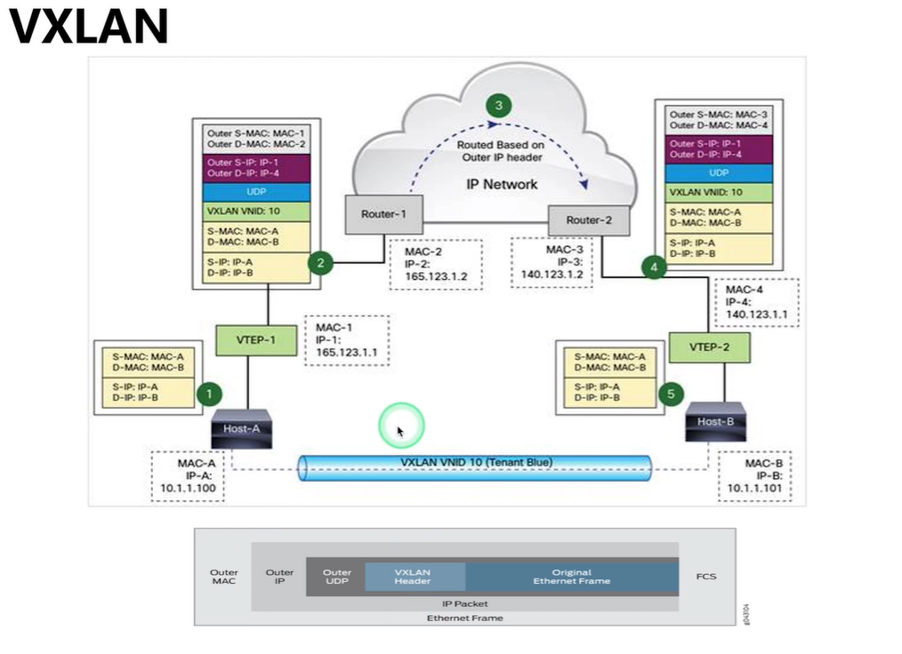
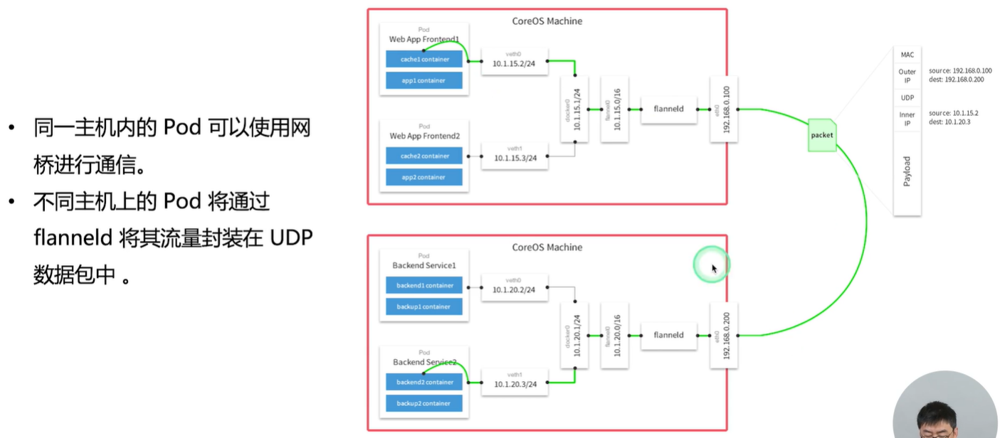

# Docker 原理

## Namespace

> 进程隔离
>
> 类型：`mnt`, `net`, `ipc`, `user`, `pid`, `uts`, `cgroup`, `time`

```shell
# 查看当前系统拥有的 namespace
$ lsns
# /proc/<pid>/ns
$ ls -al /proc/<pid>/ns
# 使用其他进程的命名空间运行程序。进入到指定 namespace 查看相关配置
$ nsenter 
# 运行一个程序，其中一些名称空间不与父级共享。在指定 namespace 下执行程序
$ unshare 
```

### 实现原理

### Shell command

- lsns

    ```shell
    Usage:
        lsns [options] [<namespace>]

    List system namespaces.

    Options:
        -J, --json             use JSON output format
        -l, --list             use list format output
        -n, --noheadings       don't print headings
        -o, --output <list>    define which output columns to use
            --output-all       output all columns
        -p, --task <pid>       print process namespaces
        -r, --raw              use the raw output format
        -u, --notruncate       don't truncate text in columns
        -W, --nowrap           don't use multi-line representation
        -t, --type <name>      namespace type (mnt, net, ipc, user, pid, uts, cgroup, time)

        -h, --help             display this help
        -V, --version          display version

    Available output columns:
            NS  namespace identifier (inode number)
          TYPE  kind of namespace
          PATH  path to the namespace
        NPROCS  number of processes in the namespace
           PID  lowest PID in the namespace
          PPID  PPID of the PID
       COMMAND  command line of the PID
           UID  UID of the PID
          USER  username of the PID
       NETNSID  namespace ID as used by network subsystem
          NSFS  nsfs mountpoint (usually used network subsystem)
           PNS  parent namespace identifier (inode number)
           ONS  owner namespace identifier (inode number)
    ```

- nsenter

    ```shell
    Usage:
        nsenter [options] [<program> [<argument>...]]

    Run a program with namespaces of other processes.

    Options:
        -a, --all              enter all namespaces
        -t, --target <pid>     target process to get namespaces from
        -m, --mount[=<file>]   enter mount namespace
        -u, --uts[=<file>]     enter UTS namespace (hostname etc)
        -i, --ipc[=<file>]     enter System V IPC namespace
        -n, --net[=<file>]     enter network namespace
        -p, --pid[=<file>]     enter pid namespace
        -C, --cgroup[=<file>]  enter cgroup namespace
        -U, --user[=<file>]    enter user namespace
        -T, --time[=<file>]    enter time namespace
        -S, --setuid <uid>     set uid in entered namespace
        -G, --setgid <gid>     set gid in entered namespace
            --preserve-credentials do not touch uids or gids
        -r, --root[=<dir>]     set the root directory
        -w, --wd[=<dir>]       set the working directory
        -F, --no-fork          do not fork before exec'ing <program>
        -Z, --follow-context   set SELinux context according to --target PID

        -h, --help             display this help
        -V, --version          display version
    ```

- unshare

    ```shell
    Usage:
    unshare [options] [<program> [<argument>...]]

    Run a program with some namespaces unshared from the parent.
    运行一个程序，其指定名称空间不与父级共享。

    Options:
        -m, --mount[=<file>]      unshare mounts namespace
        -u, --uts[=<file>]        unshare UTS namespace (hostname etc)
        -i, --ipc[=<file>]        unshare System V IPC namespace
        -n, --net[=<file>]        unshare network namespace
        -p, --pid[=<file>]        unshare pid namespace
        -U, --user[=<file>]       unshare user namespace
        -C, --cgroup[=<file>]     unshare cgroup namespace
        -T, --time[=<file>]       unshare time namespace

        -f, --fork                fork before launching <program>
        --map-user=<uid>|<name>   map current user to uid (implies --user)
        --map-group=<gid>|<name>  map current group to gid (implies --user)
        -r, --map-root-user       map current user to root (implies --user)
        -c, --map-current-user    map current user to itself (implies --user)

        --kill-child[=<signame>]  when dying, kill the forked child (implies --fork)
                                    defaults to SIGKILL
        --mount-proc[=<dir>]      mount proc filesystem first (implies --mount)
        --propagation slave|shared|private|unchanged
                                modify mount propagation in mount namespace
        --setgroups allow|deny    control the setgroups syscall in user namespaces
        --keep-caps               retain capabilities granted in user namespaces

        -R, --root=<dir>          run the command with root directory set to <dir>
        -w, --wd=<dir>            change working directory to <dir>
        -S, --setuid <uid>        set uid in entered namespace
        -G, --setgid <gid>        set gid in entered namespace
        --monotonic <offset>      set clock monotonic offset (seconds) in time namespaces
        --boottime <offset>       set clock boottime offset (seconds) in time namespaces

        -h, --help                display this help
        -V, --version             display version
    ```

## Cgroups

> 对进程进行资源控制和监控，`cpu`、`cpuacct`、`cpuset`、`devices`、`blkio`、`freezer`、`memory`、`net_cls`、`ns`、`pid`
>
> Linux 系统通过层级（Hierarchy）结构管理
>
> 

```shell
# cgroup 配置路径 /sys/fs/cgroup
```

### Linux 调度器

- CFS，Completely Fair Schedule，完全公平调度器

    > 虚拟运行时间：vruntime = 实际执行时间 * 1023 / 权重
    >
    > 

- RT

### CPU 子系统

### Memory 子系统

> 压榨型资源，会触发 killer
>
> `memory.oom_control`

### Cgroups driver

- Linux：系统默认为 systemd
- Docker: Docker 默认为 cgroupfs

> k8s 默认 --cgroup-driver=systemd，如果运行的 cgroup 不一致报错

## RootFS（根文件系统）

### CoW（Copy on Write）写时复制

### 存储驱动

- AUFS
- OverlayFS
- Device Mapper
- BuFS
- ZFS

### FS shell command

- `mount`

    ```sheell
    Usage:
        mount [-lhV]
        mount -a [options]
        mount [options] [--source] <source> | [--target] <directory>
        mount [options] <source> <directory>
        mount <operation> <mountpoint> [<target>]

    Mount a filesystem.

    Options:
        -a, --all               mount all filesystems mentioned in fstab
        -c, --no-canonicalize   don't canonicalize paths
        -f, --fake              dry run; skip the mount(2) syscall
        -F, --fork              fork off for each device (use with -a)
        -T, --fstab <path>      alternative file to /etc/fstab
        -i, --internal-only     don't call the mount.<type> helpers
        -l, --show-labels       show also filesystem labels
        -n, --no-mtab           don't write to /etc/mtab
            --options-mode <mode>
                                what to do with options loaded from fstab
            --options-source <source>
                                mount options source
            --options-source-force
                                force use of options from fstab/mtab
        -o, --options <list>    comma-separated list of mount options
        -O, --test-opts <list>  limit the set of filesystems (use with -a)
        -r, --read-only         mount the filesystem read-only (same as -o ro)
        -t, --types <list>      limit the set of filesystem types
            --source <src>      explicitly specifies source (path, label, uuid)
            --target <target>   explicitly specifies mountpoint
            --target-prefix <path>
                                specifies path used for all mountpoints
        -v, --verbose           say what is being done
        -w, --rw, --read-write  mount the filesystem read-write (default)
        -N, --namespace <ns>    perform mount in another namespace

        -h, --help              display this help
        -V, --version           display version

    Source:
        -L, --label <label>     synonym for LABEL=<label>
        -U, --uuid <uuid>       synonym for UUID=<uuid>
        LABEL=<label>           specifies device by filesystem label
        UUID=<uuid>             specifies device by filesystem UUID
        PARTLABEL=<label>       specifies device by partition label
        PARTUUID=<uuid>         specifies device by partition UUID
        ID=<id>                 specifies device by udev hardware ID
        <device>                specifies device by path
        <directory>             mountpoint for bind mounts (see --bind/rbind)
        <file>                  regular file for loopdev setup

    Operations:
        -B, --bind              mount a subtree somewhere else (same as -o bind)
        -M, --move              move a subtree to some other place
        -R, --rbind             mount a subtree and all submounts somewhere else
        --make-shared           mark a subtree as shared
        --make-slave            mark a subtree as slave
        --make-private          mark a subtree as private
        --make-unbindable       mark a subtree as unbindable
        --make-rshared          recursively mark a whole subtree as shared
        --make-rslave           recursively mark a whole subtree as slave
        --make-rprivate         recursively mark a whole subtree as private
        --make-runbindable      recursively mark a whole subtree as unbindable
    ```

## OCI 标准

## 引擎架构

- daeman
- containerd
- containerd-shim
- runc

## 容器网络

### 模式

- NULL
    > 创建**独立的**网络空间，但不做任何配置。用户通过 network 命令配置。
- Host
    > 使用主机网络空间，复用主机网络
- Container
    > 重用其他容器的网络
- Bridge
    > 使用 Linux 网络和 `iptables` 提供容器互联。
    >
    > Docker 会再主机创建名为 `docker0` 的网桥，通过 `veth pair` 连接主机的每个 `endpoint`。

### `NULL` 模式

### `Bridge` 模式

> **默认**
>
> `apt install bridge-utils -y` 安装 bridge 工具使用 `brctl` 命令

端口映射：iptables 做端口转发

### 跨主机网络

- Overlay
    > 通过网络分包实现
    >
    > VXLAN 
    >
    > k8s 网络插件 Flannel 
- Underlay
    > 使用现有底层网络，为每个容器配置可路由的网络 ip
